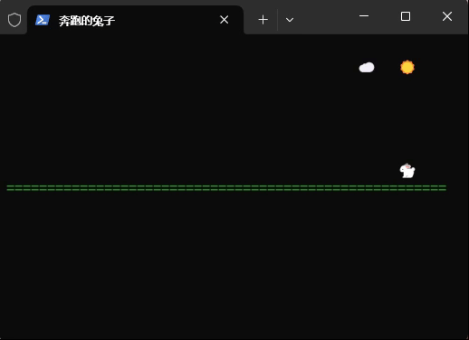

# Bunny Term 兔子终端

<p align="center"></p>

**<p align="center">workbunny/bunny-term</p>**

**<p align="center">🐇 PHP-兔 子 终 端 库 🐇</p>**

<!-- 图居中 -->
<center>

</center>

## 依赖

- PHP 8.3+
- FFI 拓展
- 支持 Linux、Windows 平台

### 安装

```sh
composer require workbunny/term
```

### 基础用法

```php
use Workbunny\Term\Tui;
use Workbunny\Term\KeyboardKey;

// 示例
Tui::init(); // 初始化

Tui::setTitle("MyTui"); // 标题

$num = 24;
while (Tui::shouldClose()) { //主循环
    // 按键A按下时
    if (Tui::keyPressed(KeyboardKey::KeyA)) {
        $num++;
    }
    Tui::begin(); // 开始绘画

    Tui::bgColor(63, 81, 181); //背景色
    Tui::rect(20, 6, 41, 10); // 矩形
    Tui::text($num, 8, "你好"); //绘制文本

    Tui::end(); // 结束绘画
}
Tui::close();//关闭
```
